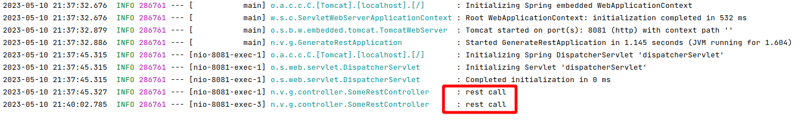

# Rest Mock Server

It listens 8081 port and serves a waits for a get query.

To test it, just use curl.

```bash
curl http://localhost:8081
```
Response will be similar to following: 
```json
{ 
   "testString": "Some text",
   "testInteger": 123
}
```

When it happens in java logs you will see "rest call" lines.

